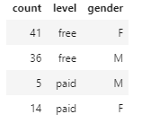
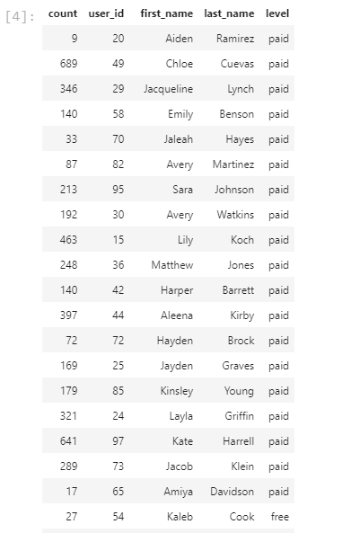
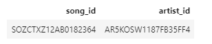

# Sparkify Song play database

Sparkify presently has no way to review or analyse their user and song data.  prestnly all of the user and song information is stored in JSON files.

## Motivation

The Sparkify streaming company want to start analysing thier user behaviours. The behaviours can theb grouped by subscription level, gender, location or any other grouping that data anlaysis team can use.

## Technical Specs
**Built with:**
     *Python
     *SQL

The database will use a star schema that will be optimized for song play analysis. 

The database will be centered on a fact table called song plays.  This will then be conenct to a number of dimension tables. The dimension tables will hodl the data for the songs, users , artists and time.

The ETL are b python wich will allow for a easier manipulation of the JSON files tioget the required data loaded into the database. 

The python files are run through the terminal.  the create_tables.py must be run first to create the tables and to clear out any existing bad data in the database.
Then the etl.py is run to process the JSON files
example: python create_tables.py
         python etl.py

### Description of files
sql_queries.py - Python file has all of the nessary sql scripts to run create, drop and insert into the tables for the sparkify database 
create_tables.py - Python files that created the conection to the database and creates the tables for the sparkify database 
etl.py - Python file that process the JSOn files and iserts the records into the database 
etl.ipynb - notebook to develop and test run the data processing before the committing code to the python file
test.ipynb - notebook to test the verify that the records were inserted into the database correctly
README.md - descrition of project, the files in the project and how to run the files.  

## Sample Queries
    This query looks at the number of paid and free plans by gender 
    1. select count(users.user_id),users.level,users.gender FROM users GROUP BY users.level,users.gender
    
    
    This query looks at the number of songs played by user and if that user is on the free plan or the paid plan
    2. SELECT count(songplays.user_id), users.user_id, users.first_name,users.last_name,users.level  FROM songplays join users on songplays.user_id = users.user_id  group by users.user_id, users.first_name,users.last_name,users.level order by users.level desc
    
    

    This query looks at the data quality of the song plays table. presntly there is only one played somng that is linked to the songs and artist tables.
    3. select songplays.song_id ,songplays.artist_id from songplays where  songplays.song_id != 'None' or songplays.artist_id != 'None'
    
    
    